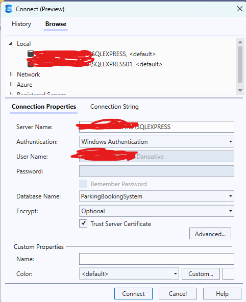

A Group Project for CSE IU PDM Course.

 Installation:

 Database Setup
- Microsoft SQL Server Management Studio (2021)
- Microsft SQL Express Server (2019)
- Node.js (Latest)

1. When installing SQL Express Server (2019), choose either Basic or Custom but it is prefered to choose Basic when the installation is done.

2. After the installation, download SQL Server Management Studio to be able to manage the database inside the created Express Server

To check if the server is actually in your local machine

3. Put the Query Scripts in QueryScriptforDB to create the table in the database of the SQLServerExpress that's connected in